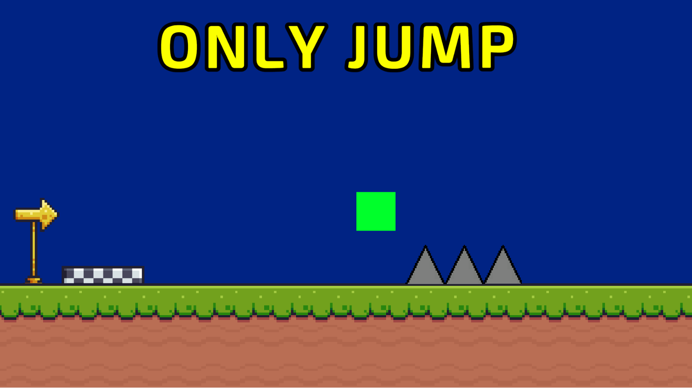
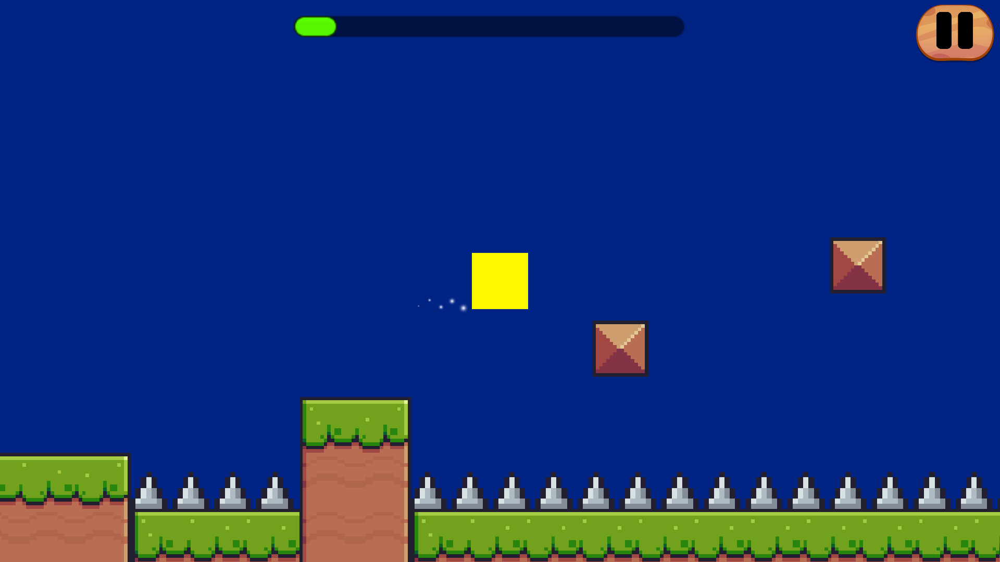
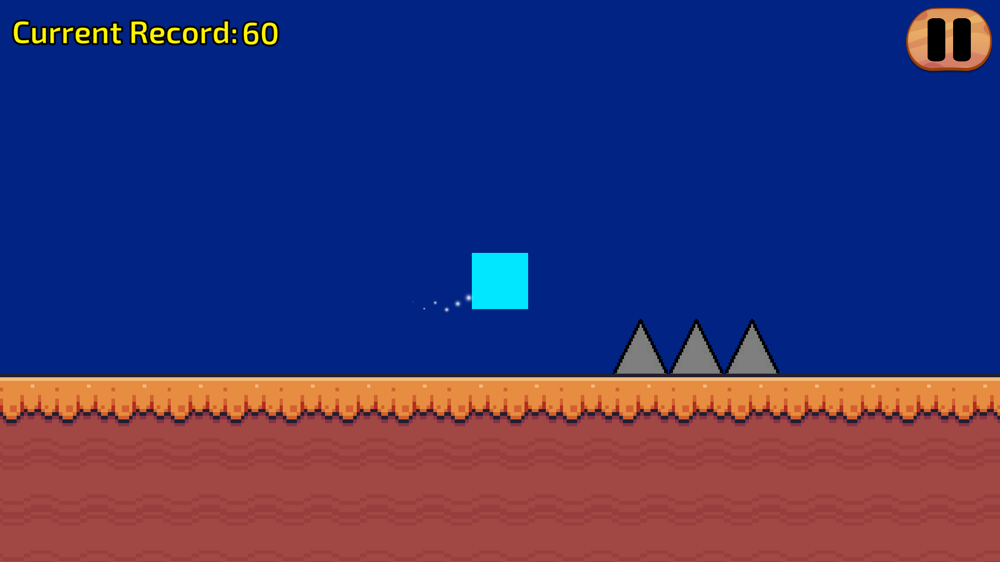
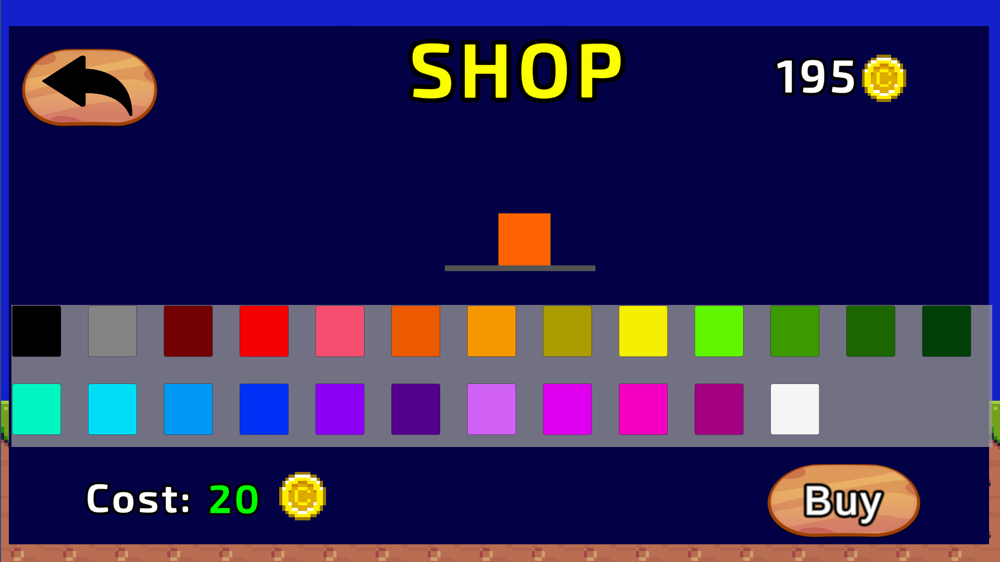
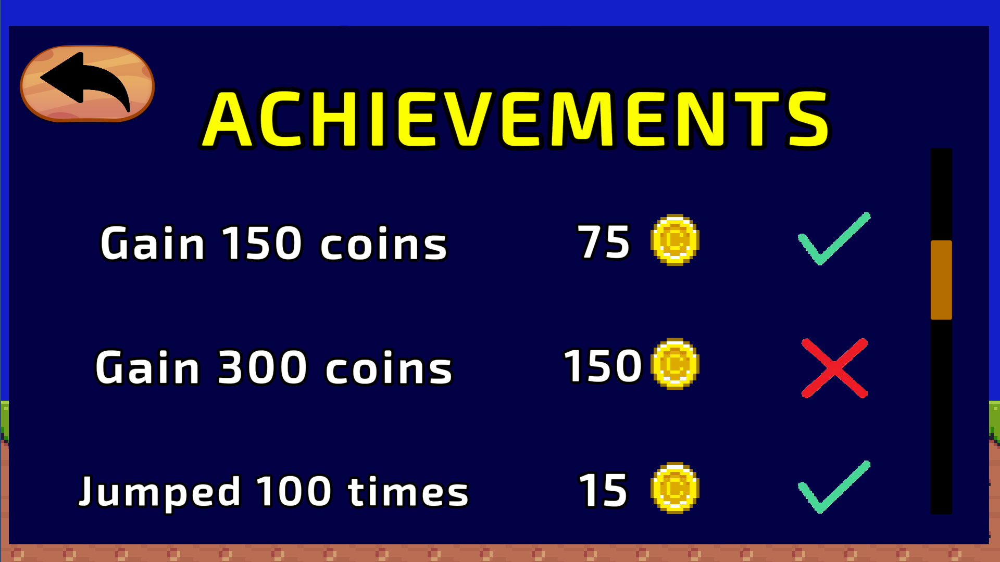

Only Jump is a amazing platform game where your primary objective is to navigate through various obstacles using only your jumping skills.

<b>Itch:<b> https://libertox.itch.io/only-jump  

# Game Modes:

## <h>Campaign Mode</h> 
Game offers players three amazing levels to conquer. Each level provides a unique and thrilling experience, challenging players in different ways. 
  

## <b>Record Mode</b> 
In this mode, players aim to achieve the highest score possible.
  

# Features

## <h>Shop</h> 
The game features a shop where players can spend in-game currency earned during gameplay to purchase various of colorful skins.
  

  
## <h>Achievements System</h> 
The achievements system adds an extra layer of challenge and rewards to the game. Players can earn achievements by completing specific tasks or reaching significant milestones within the game. 
  

